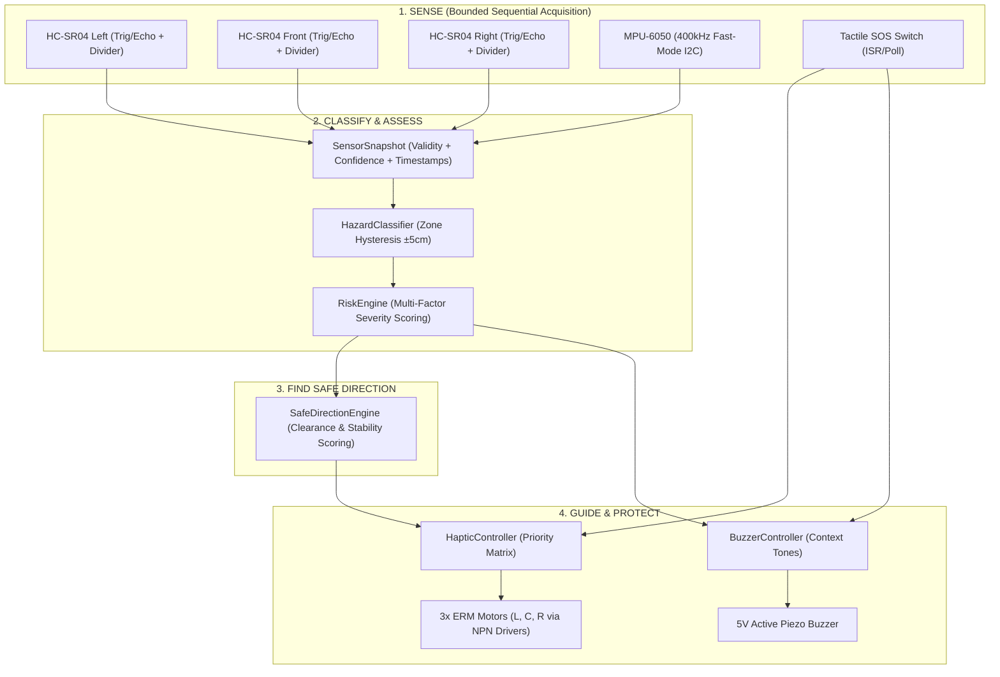

# AngRaksha — System Architecture & Implementation Blueprint

**Project:** AngRaksha (Team Astra)  
**Event:** NIRMAAN 2026 | **Track:** Smart Mobility & Aerospace  
**Problem Statement:** Directional Hazard Detection and Intuitive Spatial Haptic Guidance for Visually Impaired Pedestrians  

---

## 1. Executive Summary & Core Philosophy

AngRaksha is an assistive electronic travel aid (ETA) mounted to a pedestrian's mobility cane or wearable harness. Its primary objective is to move beyond passive proximity beepers by **actively determining and communicating clear, navigable paths in real time** through an intuitive 3-motor spatial haptic interface.

### Fundamental Pipeline
```
[ SENSE ] ──► [ CLASSIFY ] ──► [ ASSESS RISK ] ──► [ FIND SAFE DIRECTION ] ──► [ GUIDE ] ──► [ PROTECT ]
```



---

## 2. Ultrasonic Timing Model & Bounded $\le 42\text{ ms}$ Full-Scan Budget

### Bounded Acquisition Envelope for Pedestrian Navigation
$$\text{Time of Flight } t_{\text{echo}} = \frac{2 \times \text{Distance}}{c_{\text{sound}}} \quad \left(c_{\text{sound}} \approx 0.0343\,\text{cm}/\mu\text{s}\right)$$

For typical walking speeds ($\sim 1.0 - 1.4\text{ m/s}$), an algorithmic detection envelope of **$150\text{ cm}$** provides approximately $1.0\text{ to }1.5\text{ s}$ of advance reaction buffer while establishing a deterministic scan cycle:

1. **Configured Detection Envelope ($150\text{ cm}$)**:
   - Round-trip echo duration for $150\text{ cm} = \frac{2 \times 150}{0.0343} \approx 8,746\,\mu\text{s} \approx 8.75\,\text{ms}$.
   - Hardware timeout is clamped strictly at **$9.0\,\text{ms}$** (`HCSR04_TIMEOUT_US = 9000`).
2. **Inter-Sensor Acoustic Guard Interval**:
   - A **$5.0\,\text{ms}$** guard window is enforced between sensor firings to allow residual acoustic multi-path reflections to attenuate.
3. **Sequential Scan Slots**:
   - Single sensor slot $= 9.0\,\text{ms (timeout bound)} + 5.0\,\text{ms (guard)} = \mathbf{14.0\,\text{ms}}$.
   - Bounded full 3-sensor scan cycle (Left $\rightarrow$ Front $\rightarrow$ Right) $= 3 \times 14.0\,\text{ms} = \mathbf{42.0\,\text{ms}}$ worst-case.
   - **Dynamic Early Return**: When obstacles are closer (e.g. at $40\text{ cm}$), echo returns in $\sim 2.33\text{ ms}$, yielding live scan cycles between **$20\text{ ms}$ and $35\text{ ms}$**.
   - **Multi-Metric Telemetry**: Serial output streams `CTRL` (decision computation), `SCAN` (actual measured scan time), and `BOUND` ($42.0\text{ ms}$ upper bound).

---

## 3. Execution Concurrency, Memory & Thread-Safety Model

- **Single-Task Deterministic Loop**: The entire pipeline (`setup()` and `loop()`) runs as a single deterministic control loop on ESP32 Core 1.
- **Zero Race Conditions on Application State**: No concurrent worker threads write to shared snapshots.
- **ISR-Safe Synchronization**: Emergency SOS button uses a minimal `volatile bool` latch flag set in the ISR and cleared safely in the primary loop.
- **Zero Dynamic Heap Allocation**: Zero calls to `malloc`, `free`, `new`, `delete`, `std::vector`, or Arduino `String` inside the control loop. All buffers and state models are statically allocated.

---

## 4. Sliding Window 3-Tap Median Filter

- **Ring Buffer Architecture**: Implemented as a 3-element rolling sliding window initialized with a nominal baseline.
- **Zero Latency Penalty**: Every newly acquired ping updates the circular buffer and instantly evaluates the median sorting network. The system never blocks or pauses waiting for 3 new pings.

---

## 5. Failsafe & Degraded Mode Specification

```
Sensor Status ──► [ ReadingValidity Check ]
                         │
         ┌───────────────┴───────────────┐
         ▼                               ▼
      [ VALID ]                  [ INVALID / TIMEOUT / DISCONNECTED ]
         │                               │
  Proceed to Fusion                      ▼
                                 Is Front Sensor Failed?
                                 ├── YES ──► Force WARNING / STOP State (Do not guide blindly)
                                 └── NO  ──► Mark Zone Degraded, Re-weight lateral scores
```

### Fault Handling Rules:
1. **Single Lateral Sensor Fault (e.g. Left fails)**:
   - System enters `SystemState::DEGRADED`.
   - Left zone confidence set to `0.0`.
   - Safe direction engine evaluates only between `FORWARD`, `RIGHT`, and `STOP`.
2. **Front Sensor Fault**:
   - System cannot confirm path ahead $\rightarrow$ immediately drops into conservative `WARNING` or `STOP` mode.
3. **All Distance Sensors Faulted**:
   - Enters `SystemState::SENSOR_FAULT`.
   - Issues recurring fault beeps on the buzzer and disables directional steering.
4. **IMU Disconnected / I2C Bus Hang**:
   - Disables ground hazard/drop detection.
   - Mobility continues using distance sensors in degraded mode; I2C bus auto-reset is attempted non-blockingly.

---

## 6. Multi-Signal Temporal IMU Motion-Event Engine

- **5-sample (100 ms) sliding window** at 50 Hz.
- Free-fall: $|\mathbf{a}| < 0.35\text{g}$ for $\ge 3$ samples.
- Severe tilt: Pitch/Roll $> 45^\circ$ for $> 150\text{ ms}$.
- Latches `GROUND_HAZARD` state for $1200\text{ ms}$ for distinct haptic delivery.

---

## 7. Explainable Safe-Direction Scoring Model

$$\text{Score}(d) = \left(w_{\text{clear}} \times \text{DistanceCm}(d)\right) - P_{\text{danger}}(d) - P_{\text{caution}}(d) + B_{\text{stability}}(d)$$

- $w_{\text{clear}} = 1.0$
- $P_{\text{danger}} = 100.0$ (if $< 35\text{ cm}$)
- $P_{\text{caution}} = 30.0$ (if $35 - 60\text{ cm}$)
- $B_{\text{stability}} = 15.0$ (awarded to currently active direction)
- Switching margin: $> 15.0\text{ pts}$ required to switch lateral vectors.
