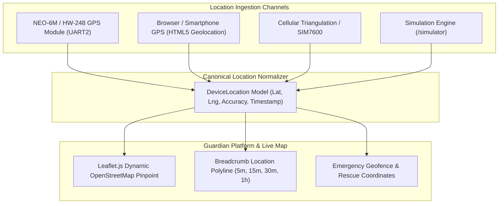

# AngRaksha — Live Location Architecture & GPS Integration

**Project:** AngRaksha (Team Astra)  
**Event:** NIRMAAN 2026 | **Track:** Smart Mobility & Aerospace  

---

## 1. Multi-Tier Location Provider Architecture

To maintain flexibility while physical GPS hardware variants (NEO-6M / HW-248 / Phone Tethering) are evaluated on the bench, AngRaksha defines a clean **Location Provider Abstraction**:

```typescript
export interface LocationProvider {
  getCurrentLocation(): Promise<DeviceLocation | null>;
  isLocked(): boolean;
}
```



---

## 2. Real-World GPS (NEO-6M / HW-248) Hardware Wiring

When the physical GPS module is connected to the ESP32:

| GPS Module Pin (HW-248) | ESP32 GPIO | Electrical Connection |
| :--- | :--- | :--- |
| **VCC** | **5V Rail** (from CN6009) | 3.3V - 5V Compatible |
| **GND** | **Common Ground** | Shared ground plane |
| **TX** | **GPIO 16** (ESP32 RX2) | Hardware UART2 Receive |
| **RX** | **GPIO 17** (ESP32 TX2) | Hardware UART2 Transmit |

### Satellite Fix Handling
- **Outdoor Open Sky**: The module achieves a cold start 3D fix within 30–60 seconds, streaming NMEA sentences at 9600 baud.
- **Indoor Demonstration Venue**: In indoor halls with heavy concrete attenuation, satellite signals may be shielded. The platform gracefully falls back to displaying `GPS: NO_FIX` without disrupting local spatial haptic guidance, or utilizes the "Sync Phone GPS" browser button.
