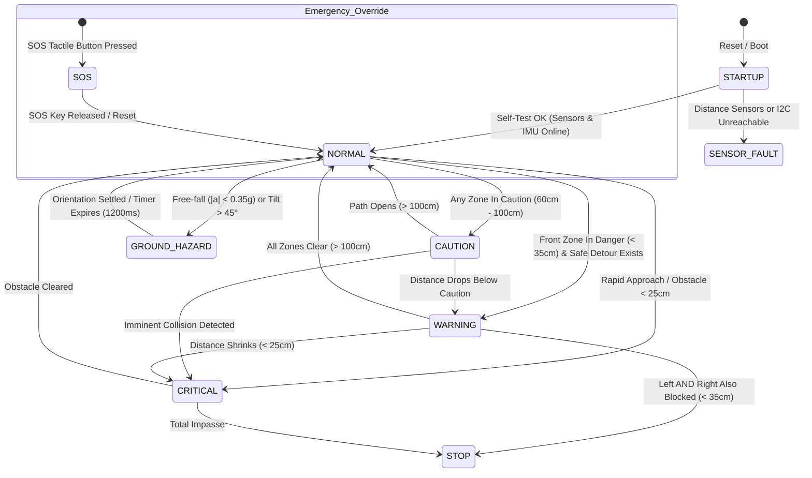

# AngRaksha — Deterministic State Machine Specification

**Project:** AngRaksha (Team Astra)  
**Event:** NIRMAAN 2026 | **Track:** Smart Mobility & Aerospace  

---

## 1. State Machine Definitions

---

## 2. State Transition Conditions & Actions

### `STARTUP`
- **Entry**: Hardware power-up or ESP32 reset.
- **Actions**: Initialize serial (115200 baud), initialize I2C bus (400 kHz), check MPU-6050 `whoAmI`, setup ultrasonic trigger/echo pins, attach SOS interrupt, configure LEDC PWM channels.
- **Exit Condition**: If primary ultrasonic sensor online, transition to `NORMAL`. If all range sensors fail, transition to `SENSOR_FAULT`.

### `NORMAL`
- **Entry**: Environment is clear across all zones ($> 100\text{ cm}$) and IMU orientation is nominal.
- **Actions**: All haptic motors remain OFF (0% PWM) to eliminate sensory fatigue. Status LED blinks heartbeat.
- **Exit Condition**: Obstacle detected in caution range or hazard event triggers.

### `CAUTION`
- **Entry**: Sensor detects obstacle between $60\text{ cm}$ and $100\text{ cm}$.
- **Actions**: Low-intensity single pulse confirmation.
- **Exit Condition**: Distance decreases to $< 35\text{ cm}$ ($\rightarrow$ `WARNING`) or increases to $> 100\text{ cm} + \text{hysteresis}$ ($\rightarrow$ `NORMAL`).

### `WARNING`
- **Entry**: Front obstacle is $< 35\text{ cm}$, but at least one lateral corridor (Left or Right) is navigable ($> 60\text{ cm}$).
- **Actions**: SafeDirectionEngine evaluates clearance scores; HapticController pulses corresponding motor (`PATTERN_GUIDE_LEFT` or `PATTERN_GUIDE_RIGHT`).
- **Exit Condition**: Clear path restored or lateral corridors close down ($\rightarrow$ `STOP`).

### `STOP` / `CRITICAL`
- **Entry**: Front is blocked ($< 35\text{ cm}$) AND both Left and Right are blocked ($< 35\text{ cm}$), or Front is within emergency stopping distance ($< 25\text{ cm}$).
- **Actions**: Continuous high-intensity vibration on Center (or dual L+R) + 200 ms acoustic stop tone.
- **Exit Condition**: At least one lateral vector clears above threshold.

### `GROUND_HAZARD`
- **Entry**: IMU detects free-fall ($|a| < 0.35\text{g}$) indicative of a sudden drop/curb/pothole, or cane tilt angle $> 45^\circ$.
- **Actions**: HapticController fires distinct *short-short-long* pulse on Center motor; buzzer issues high-pitch chirp.
- **Exit Condition**: Held active for `GROUND_HAZARD_HOLD_MS` (1200 ms) before returning to previous state.

### `SOS`
- **Entry**: Tactile emergency button depressed (active LOW interrupt/poll).
- **Actions**: Immediate continuous siren on Piezo buzzer + rapid haptic pulses on all three motors. Overrides all other subsystems unconditionally.
- **Exit Condition**: Button released and debounced.
